# 📊 Visualization Support - Complete Guide

## 🎯 Overview

Your Ontario Math Academy now supports **interactive visualizations** using Mermaid.js! Create flowcharts, diagrams, number lines, and process visualizations to help students understand concepts better.

---

## ✨ What's Been Added

### **1. Mermaid.js Integration**
- Create diagrams with simple text syntax
- Flowcharts, graphs, and process diagrams
- Automatic rendering
- Beautiful, professional appearance

### **2. Supported Diagram Types**
- **Flowcharts**: Show process steps
- **Graphs**: Display relationships
- **Number Lines**: Visualize integers, fractions
- **Process Diagrams**: Step-by-step procedures
- **Concept Maps**: Show connections

### **3. AI Generates Visualizations**
- AI automatically creates diagrams
- Contextual visualizations
- Enhances understanding
- Professional appearance

---

## 📝 Mermaid Syntax

### **Basic Flowchart**

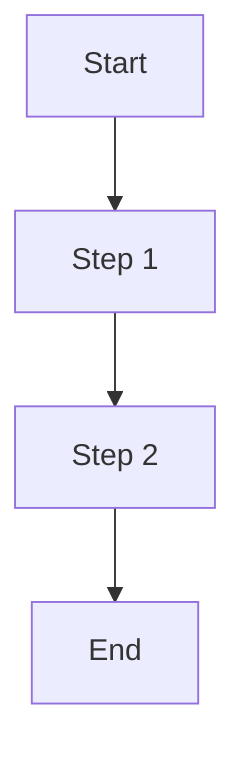

**In Content:**
````markdown

````

### **Horizontal Flow**

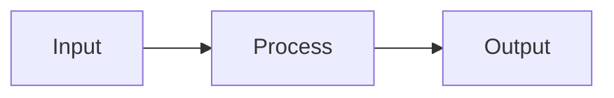

---

## 🎓 Math-Specific Visualizations

### **1. Number Line (Integers)**

````markdown
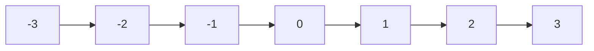
````

**Shows:**
```
-3 → -2 → -1 → 0 → 1 → 2 → 3
```

### **2. Fraction Addition Process**

````markdown
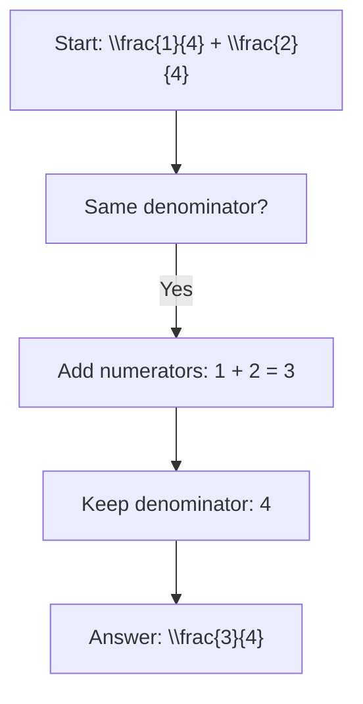
````

### **3. Order of Operations**

````markdown
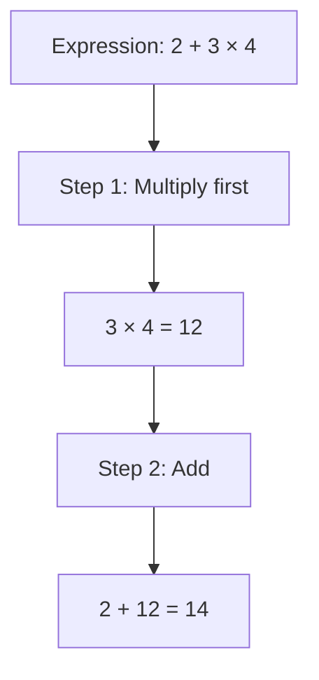
````

### **4. Solving Equations**

````markdown
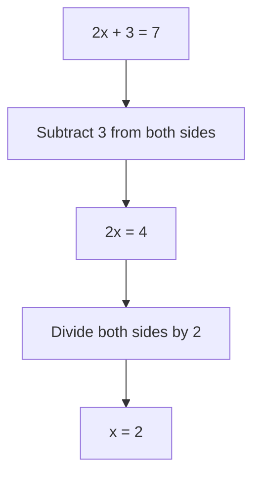
````

### **5. Pythagorean Theorem**

````markdown
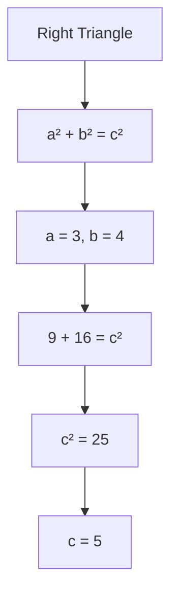
````

---

## 🎨 Diagram Types

### **Flowchart (Top to Bottom)**

````markdown
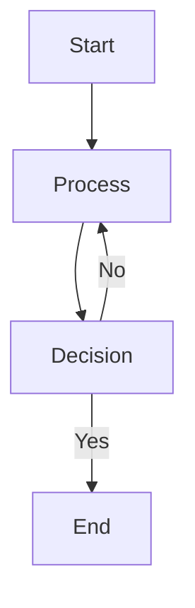
````

### **Flowchart (Left to Right)**

````markdown
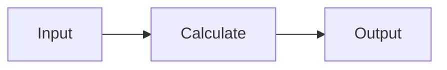
````

### **Concept Map**

````markdown
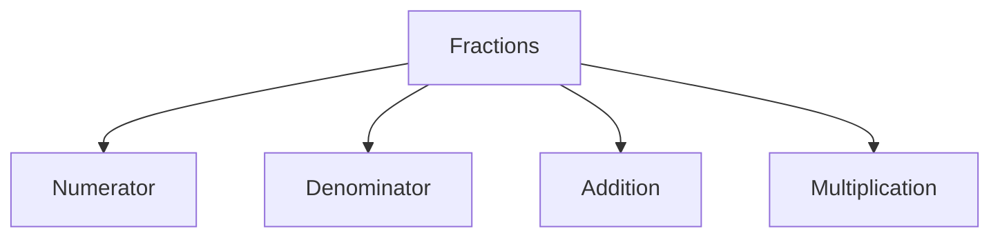
````

---

## 📚 Examples by Topic

### **Integers: Number Line**

````markdown
## Visual Representation

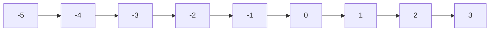

The number line shows integers extending infinitely in both directions.
````

### **Fractions: Addition Process**

````markdown
## Step-by-Step Process

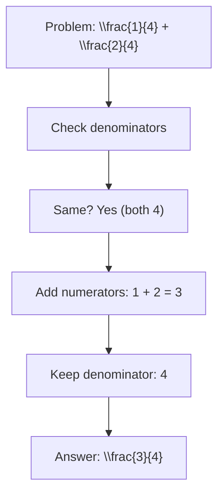
````

### **Algebra: Solving Equations**

````markdown
## Solving Process

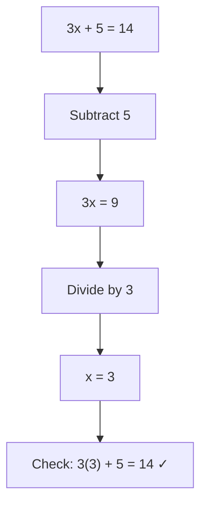
````

### **Geometry: Area Calculation**

````markdown
## Finding Area

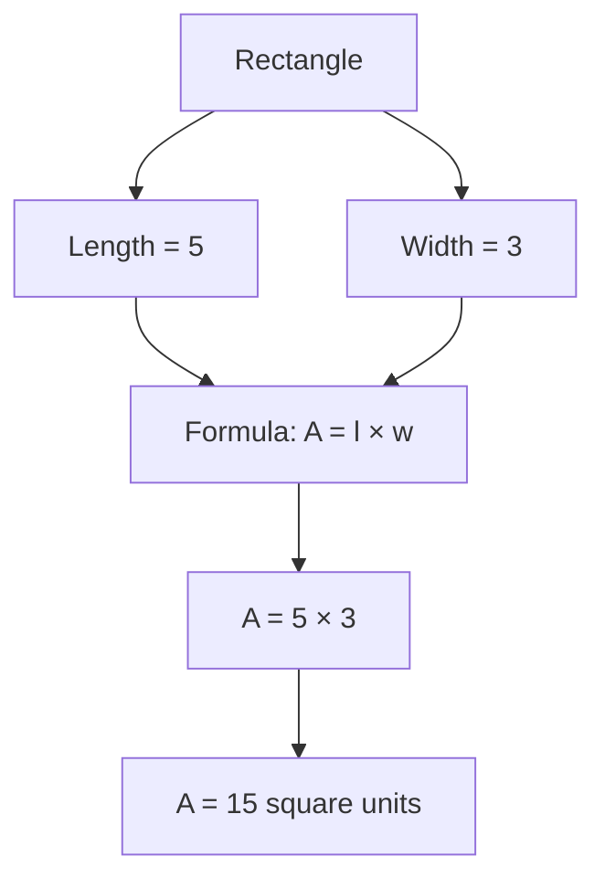
````

### **Order of Operations (BEDMAS)**

````markdown
## BEDMAS Process

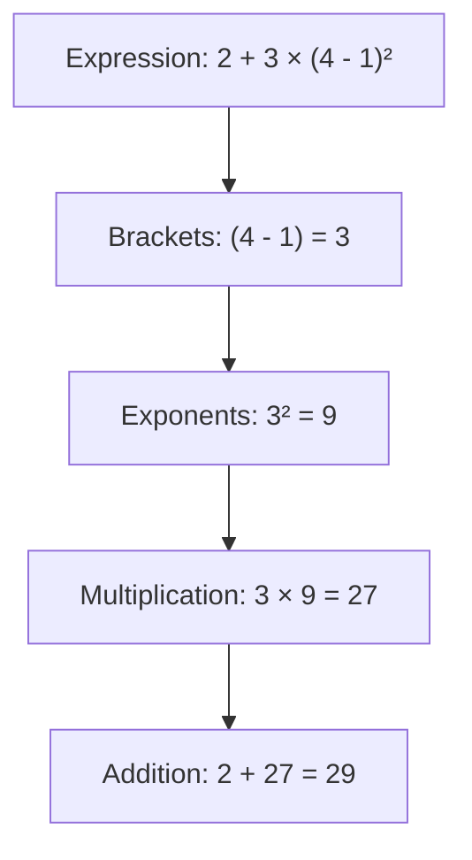
````

---

## 🤖 AI-Generated Visualizations

### **How AI Uses Diagrams**

When you generate content, AI will automatically include diagrams for:

1. **Process Steps**: How to solve problems
2. **Number Lines**: Visual representation of numbers
3. **Concept Maps**: Relationships between ideas
4. **Flowcharts**: Decision-making processes
5. **Step-by-Step**: Problem-solving procedures

### **Example AI Output**

````markdown
# Introduction to Integers

## What are Integers?

Integers are whole numbers that can be positive, negative, or zero.

### Number Line Visualization


### Adding Integers Process

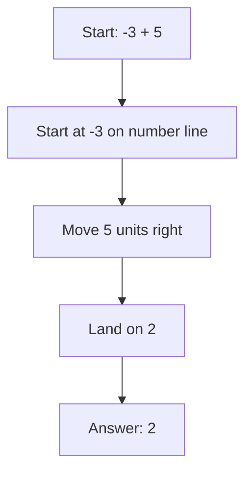
````

---

## 🎯 Best Practices

### **1. Use Diagrams for Complex Concepts**

✅ **Good Use Cases:**
- Multi-step processes
- Number line representations
- Decision trees
- Concept relationships
- Problem-solving steps

❌ **Avoid:**
- Simple one-step operations
- Overcomplicated diagrams
- Too many nodes

### **2. Keep Diagrams Simple**

✅ **Good:**
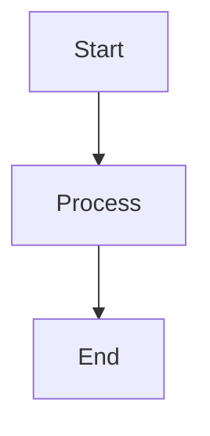

❌ **Too Complex:**
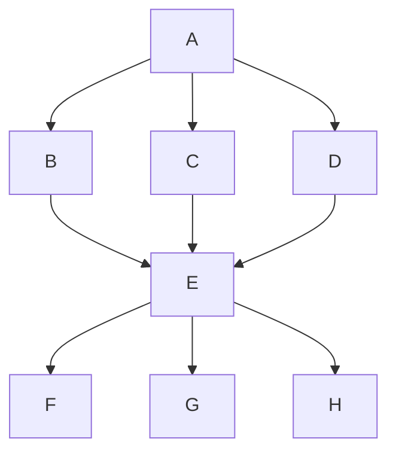

### **3. Label Clearly**

✅ **Good:**
```mermaid
graph TD
    A["Step 1: Identify the problem"]
    B["Step 2: Plan solution"]
    C["Step 3: Execute"]
```

❌ **Unclear:**
```mermaid
graph TD
    A[A] --> B[B] --> C[C]
```

---

## 📊 Diagram Styling

### **Node Shapes**

```mermaid
graph TD
    A[Rectangle]
    B([Rounded])
    C[(Database)]
    D{Diamond}
    E((Circle))
```

**Syntax:**
```
A[Rectangle]
B([Rounded])
C[(Database)]
D{Diamond}
E((Circle))
```

### **Arrow Types**

```mermaid
graph LR
    A --> B
    B -.-> C
    C ==> D
```

**Syntax:**
```
A --> B   (Solid arrow)
B -.-> C  (Dotted arrow)
C ==> D   (Thick arrow)
```

### **Labels on Arrows**

```mermaid
graph TD
    A -->|Yes| B
    A -->|No| C
```

**Syntax:**
```
A -->|Yes| B
A -->|No| C
```

---

## 🔧 Advanced Examples

### **Fraction Comparison**

````markdown
```mermaid
graph TD
    A["Compare: \\frac{1}{2} vs \\frac{1}{3}"]
    B["Find common denominator: 6"]
    C["\\frac{1}{2} = \\frac{3}{6}"]
    D["\\frac{1}{3} = \\frac{2}{6}"]
    E["\\frac{3}{6} > \\frac{2}{6}"]
    F["Therefore: \\frac{1}{2} > \\frac{1}{3}"]
    
    A --> B
    B --> C
    B --> D
    C --> E
    D --> E
    E --> F
```
````

### **Quadratic Formula Steps**

````markdown
```mermaid
graph TD
    A["ax² + bx + c = 0"]
    B["Identify: a, b, c"]
    C["Use formula: x = \\frac{-b ± \\sqrt{b²-4ac}}{2a}"]
    D["Calculate discriminant: b² - 4ac"]
    E["Solve for x"]
    
    A --> B
    B --> C
    C --> D
    D --> E
```
````

---

## 💡 Tips for Teachers

### **When to Use Diagrams**

**Use diagrams for:**
- ✅ Multi-step procedures
- ✅ Visual concepts (number lines, graphs)
- ✅ Decision-making processes
- ✅ Relationships between concepts
- ✅ Problem-solving strategies

**Skip diagrams for:**
- ❌ Simple definitions
- ❌ Single-step operations
- ❌ Text-heavy content

### **Creating Effective Diagrams**

1. **Start Simple**: Basic flowchart first
2. **Add Details**: Enhance as needed
3. **Test Understanding**: Does it clarify or confuse?
4. **Get Feedback**: Ask students if helpful

---

## ✅ Summary

### **What You Get**
✅ **Mermaid.js integration** for diagrams
✅ **Automatic rendering** in content
✅ **AI generates diagrams** automatically
✅ **Multiple diagram types**
✅ **Professional appearance**
✅ **Easy syntax**

### **Diagram Types**
✅ Flowcharts (TD, LR)
✅ Number lines
✅ Process diagrams
✅ Concept maps
✅ Decision trees

### **How to Use**
1. **AI Content**: Generates diagrams automatically
2. **Manual**: Use ` ```mermaid ` blocks
3. **Renders**: Automatically on topic pages
4. **Students**: See interactive diagrams

---

**Make math visual with diagrams! 📊🎨📐**
